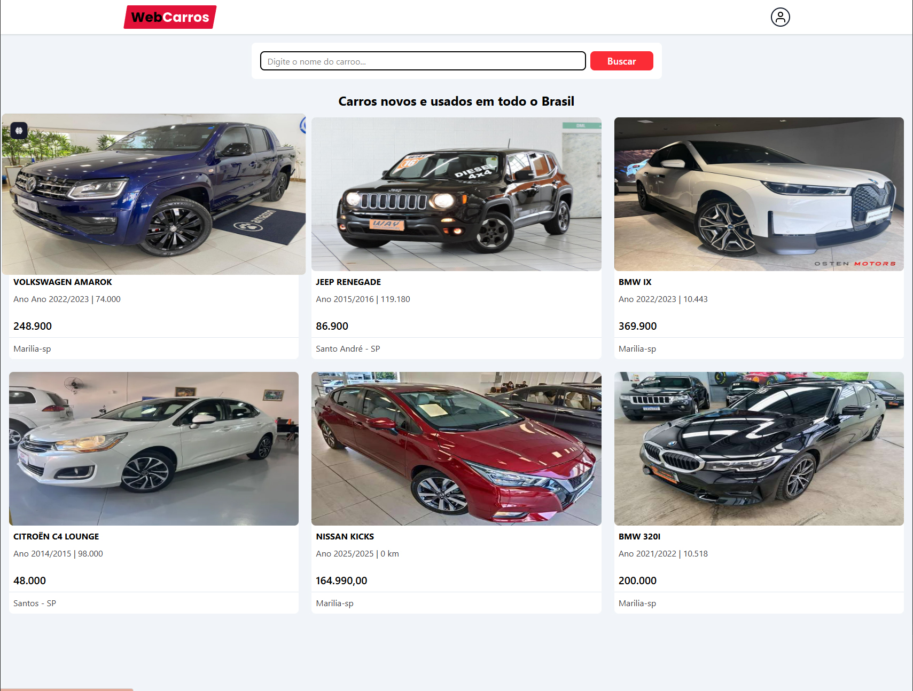
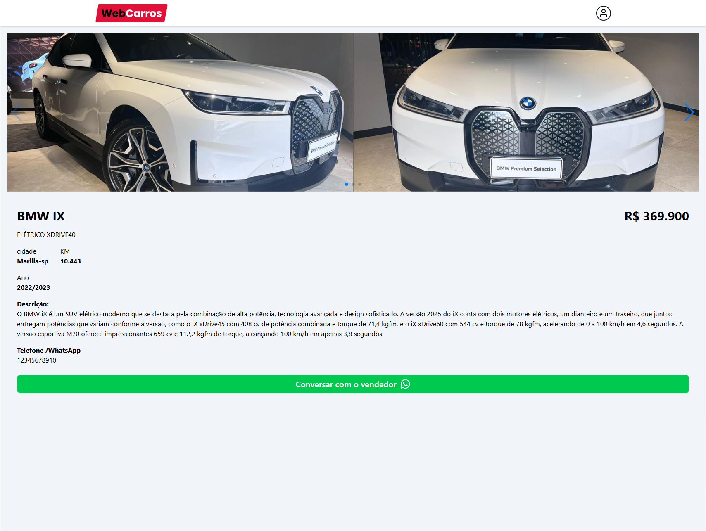
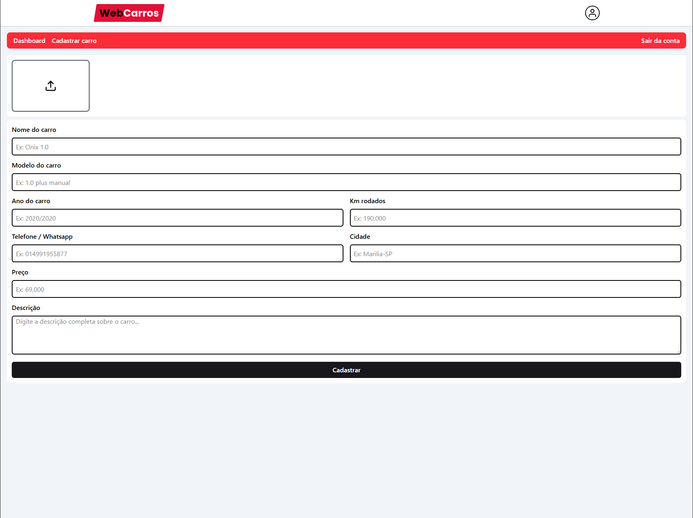
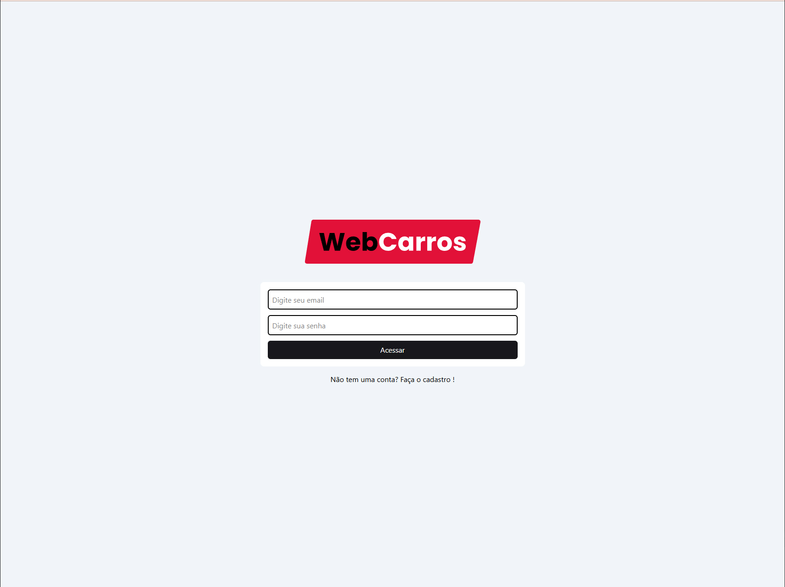
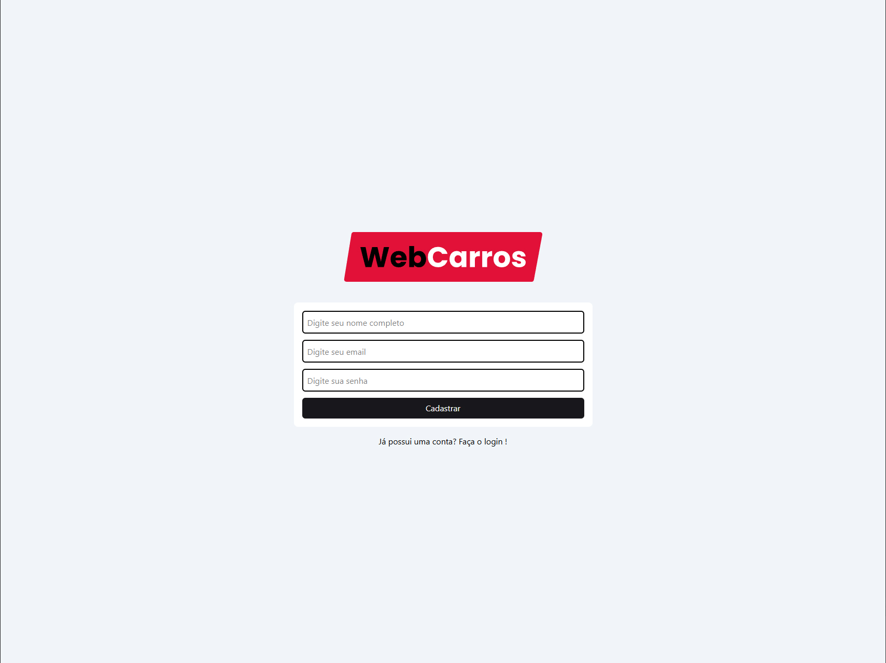

# 🚗 WebCarros


**WebCarros** é uma aplicação web para compra e venda de veículos novos e usados, feita para ser rápida, responsiva e simples de usar.  
Com integração ao **Firebase**, gerenciamento de formulários com **React Hook Form** e **Context API**, ela oferece autenticação, cadastro e visualização detalhada dos veículos.

---

## ✨ Funcionalidades

✅ **Login & Registro** com autenticação Firebase  
✅ **Cadastro de veículos** com fotos e descrição  
✅ **Busca inteligente** por nome do carro  
✅ **Página de detalhes** com todas as informações e contato do vendedor  
✅ **Dashboard** para gerenciar anúncios  
✅ **Layout responsivo** para desktop e mobile  

---

## 🛠 Tecnologias Utilizadas

| Tecnologia        | Função |
|-------------------|--------|
| **React.js** ⚛ | Interface do usuário |
| **Firebase** 🔥 | Autenticação e banco de dados |
| **React Hook Form** 📝 | Validação e controle de formulários |
| **Context API** 🌐 | Estado global da aplicação |
| **TailwindCSS** 🎨 | Layout responsivo |

---

## 📷 Screenshots

### 🏠 Página Inicial


### 📄 Detalhes do Carro


### ➕ Cadastrar Carro


### 🔑 Login


### 🆕 Registro


---

## 🚀 Como Rodar o Projeto Localmente

```bash
# Clone o repositório
git clone https://github.com/seu-usuario/webcarros.git

# Entre na pasta
cd webcarros

# Instale as dependências
npm install

# Inicie o servidor de desenvolvimento
npm start
```

🔹 **Importante:** Configure as variáveis de ambiente do Firebase no `src/services/firebaseConnection.ts` antes de rodar o projeto.

---

## 📌 Observações
- O layout foi pensado para ser moderno e responsivo.  
- As informações dos veículos são armazenadas e recuperadas do **Firebase Firestore**.  
- Login e registro usam **Firebase Authentication**.

---

## 📄 Licença
Este projeto está sob a licença **MIT**.  
Sinta-se livre para usá-lo e modificá-lo.
